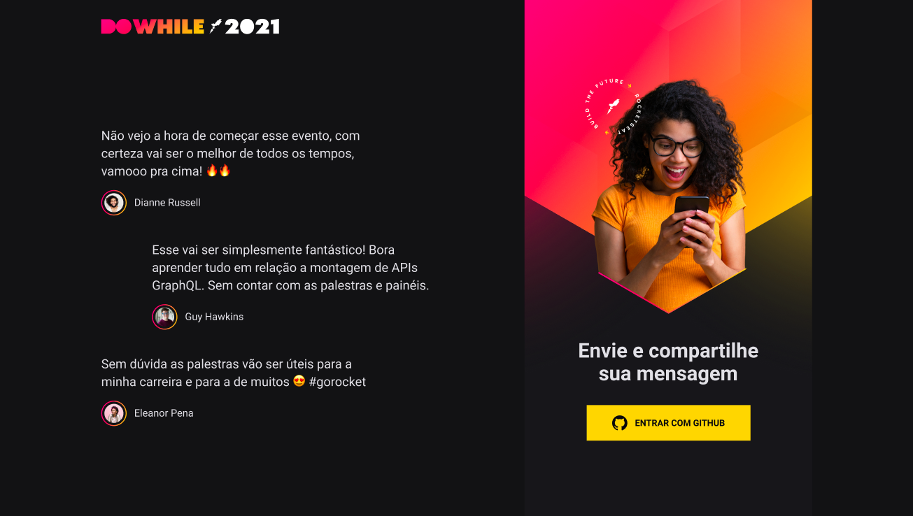

<div align="center">
  
  <br/><br/>
  
</div>

## 📃 About

Project developed during the **NLW Heat**, an online event produced by [**Rocketseat**](https://github.com/Rocketseat).

This is a web app that allows users to message their expectations for DoWhile 2021, an online event made by [**Rocketseat**](https://github.com/Rocketseat).

## 🖥 Tecnologies

<div>
  <br />
  <a href="#-tecnologias-utilizadas">
      
      
      
      
      
      
      
   </a>
</div>

This project was developed using cutting edge front-end technologies.

- [ReactJS](https://reactjs.org/)
- [Typescript](https://www.typescriptlang.org/)
- [Sass](https://sass-lang.com/)
- [NodeJS](https://nodejs.org/en/)
- [Prisma](https://www.prisma.io/)
- [SQLite](https://www.sqlite.org/index.html)
- [Socket.io](https://socket.io/)

## 🚀 Getting started

### Requirements

- You need to install both [Node.js](https://nodejs.org/en/download/) and [Yarn](https://yarnpkg.com/) to run this project.

**Clone the project and access the folder**

```bash
$ git clone https://github.com/diegogasparcruz/nlw-heat.git && cd nlw-heat
```

**Follow the steps below**

```bash
# Install the backend dependencies
$ cd backend && yarn

# Run migrations
$ yarn prisma migrate dev

# Run the backend server
$ yarn dev

# Install the frontend dependencies
$ cd ../web && yarn

# Run the web server
$ yarn dev
```

The app will be available for access on your browser at `http://localhost:3000`
